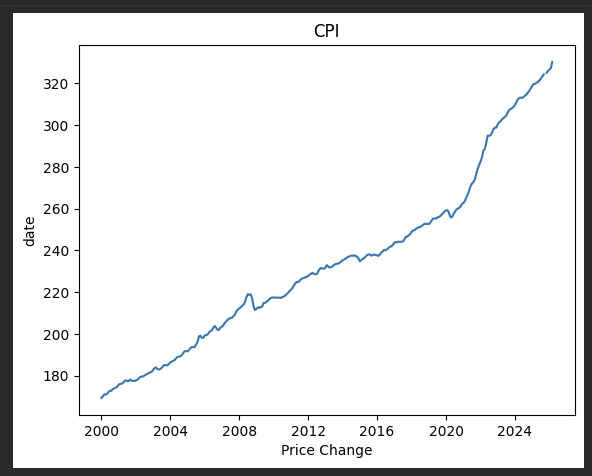
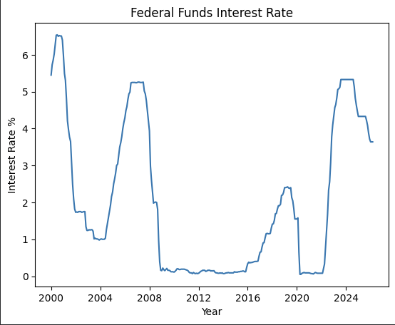
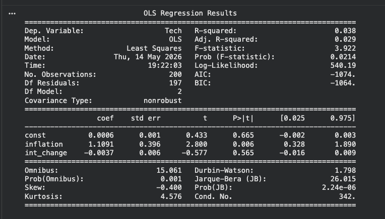
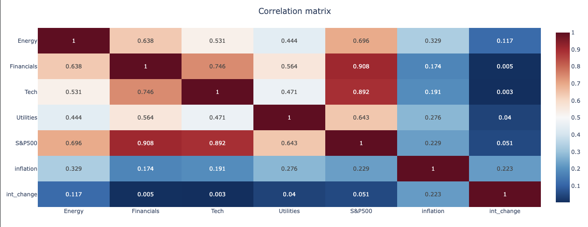
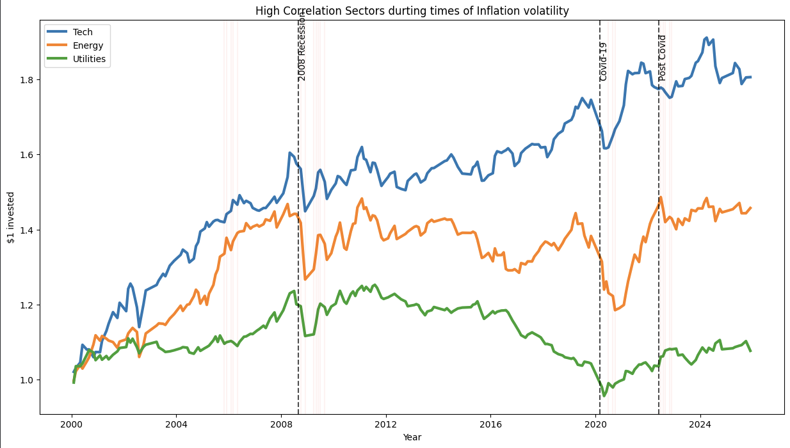
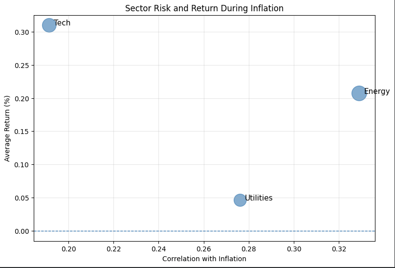

# Inflation and Sector Performance Analysis

### Exploring the relationship between inflation, interest rates, and S&P 500 sector performance using Python, FRED data, and Yahoo Finance.

**Authors:** Nathan Nemali & Daniel Virula

## Resources
- GeeksforGeeks for yfinance
- Algo Trading 101 for yfinance
- Data camp for Pandas web.reader

---

## Overview

This project analyzes how inflation and interest rate volatility impact major sectors of the S&P 500

Using macroeconomic data from FRED and market data from Yahoo Finance, we combined statistical modeling and financial analysis techniques to identify which sectors are most sensitive to inflationary conditions and how major economic events influence sector growth over time.

Our analysis focused on the time period from 2000–2025, which includes major economic events such as the 2008 Financial Crisis, the COVID-19 market crash, and the post-COVID inflation surge.

---

## Research Questions

- Which sectors are most correlated with inflation?
- How do interest rate changes impact sector returns?
- Which sectors perform best during periods of inflation volatility?
- How do major macroeconomic events impact sector growth?

---

## Data Sources

### FRED (Federal Reserve Economic Data)
- CPIAUCSL — Consumer Price Index
- FEDFUNDS — Federal Funds Interest Rate

### Yahoo Finance
- XLK — Technology
- XLF — Financials
- XLE — Energy
- XLU — Utilities
- ^GSPC — S&P 500

---

## Techniques Used

- OLS Regression
- Correlation Analysis
- Heatmap Correlation Matrix
- Bubble Plot Visualization
- Webscraping
- Rolling Volitilty Analysis
- Data Cleaning and Merging with Pandas

---
## Economic Basics

-S&P 500 is made up of several sectors, depending on what its industry focus is.
-FedFundRate is how interest rate is measured.
-CPI is how inflation is measured

---

## Inflation Trend Over Time

The graph below shows the long-term increase in inflation from 2000–2025. Significant increases occurred following the 2008 financial crisis and during the post-COVID inflation surge beginning in 2021.

*Figure 1. Consumer Price Index trend from 2000–2025.*

---

## Federal Funds Interest Rate

This graph displays changes in the Federal Funds interest rate over time. Large shifts in rates can be observed during major macroeconomic events including the 2008 recession, COVID-19, and the recent inflationary environment.

*Figure 2. Federal Funds interest rate over time.*

---

## OLS Regression Analysis

We used OLS multiple regression models to measure the relationship between sector returns, inflation, and interest rate changes.

The example below shows the Technology sector regression model. The model shows an R^2 of .038 and a coefficient of 1.1

*Figure 3. Example OLS regression output for the Technology sector.*

## Key Results

Tech: adjusted R^2 : .029, coefficient of inflation : 1.1
Financials: adjusted R^2: 0.22, coefficient of inflation: 1.23
Energy: adjusted R^2: .101, coefficient of inflation : 2.03
Utilities: adjusted R^2: .067, coefficient of inlfation: 1.24

---

## Correlation Heatmap

The heatmap below compares the relationships between inflation, interest rate changes, the S&P 500, and major market sectors.

Energy showed the strongest relationship with inflation, while Technology and Financials displayed the strongest relationship with the broader market.

*Figure 4. Correlation matrix comparing sectors, inflation, and interest rate changes.*

---

# How did These sectors perform over historic events?

This visualization compares the growth of Technology, Energy, and Utilities during major inflationary and macroeconomic periods.

The highlighted sections represent periods of elevated inflation volatility, while the vertical markers identify major economic events including the 2008 recession and post-COVID inflation surge.

*Figure 5. Sector growth comparison during major inflationary and macroeconomic periods.*

---

## Sector Risk and Return During Inflation

This bubble plot compares sectors using three dimensions simultaneously:

- X-axis → correlation with inflation
- Y-axis → average return
- Bubble size → volatility/risk

The visualization demonstrates that Energy had the strongest inflation relationship, while Technology produced the highest average return over the selected time period.

*Figure 6. Comparison of sector inflation correlation, returns, and volatility.*

---

## Main Findings

- Energy showed the strongest relationship with inflation.
- Technology produced the highest long-term return.
- Utilities were more stable but generated lower returns.
- Inflation volatility significantly impacted sector behavior.
- Different sectors reacted differently during periods of economic uncertainty.

---

## Future Improvements

If given more time and resources, we would expand this project by:

- Including additional sectors and international markets
- Applying machine learning prediction models
- Incorporating unemployment and GDP data
- Comparing inflationary periods across multiple decades

---

## Tools & Libraries

- Python
- Pandas
- NumPy
- Matplotlib
- Plotly
- Statsmodels
- yFinance
- FRED API

---

